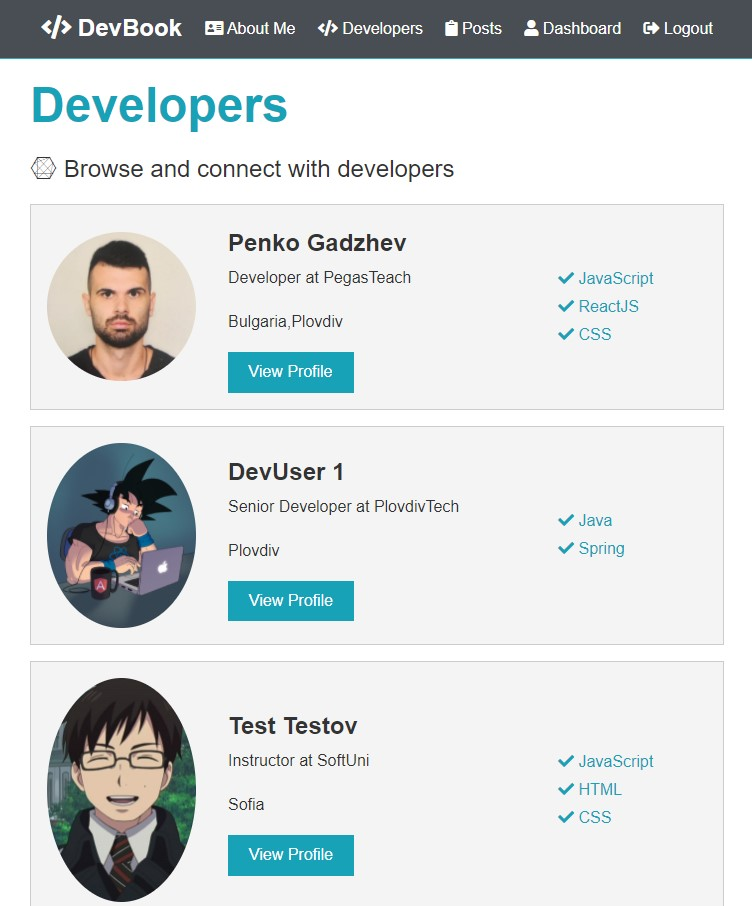

# DevBook - Social network for developers  🌍💻

- It's a small social network application that includes authentication, profiles and forum posts.

## Application Configurations  📑 

1.Start👉 the project by typing in the terminal **npm run dev** 🤘

2.The app runs on localhost:3000 🚀

3.Enjoy it  💻 !

This project was created with Create React App.:shipit:

## Technology stack  🔧

- **Frontend:** ReactJS, Redux, HTML, CSS and some libraries/tools.
- **Backend:** NodeJS, ExpressJS.
- **Database:** MongoDB
- **Hosting:** Heroku

## List of all functionalities 🎯
- Signing up / Logging in.
- Creating / Updating / Deleting a Profile.
- Sharing a portfolio with other developers.
- Creating / Deleting posts.
- Liking / Unliking a posts.
- Creating / Deleting comments to a post.

## Routing 🔄 
### User:

- POST api/users/register
- POST api/users/login
- GET api/users/current

### Profile:

- GET api/profile
- GET api/profile/all
- GET api/profile/handle/:handle
- GET api/profile/user/:user_id
- POST api/profile
- POST api/profile/experience
- POST api/profile/education
- DELETE api/profile/experience/:exp_id
- DELETE api/profile/education/:edu_id
- DELETE api/profile

### Post:

- GET api/posts
- GET api/posts/:id
- POST api/posts
- DELETE api/posts/:id
- POST api/posts/like/:id
- POST api/posts/unlike/:id
- POST api/posts/comment/:id
- DELETE api/posts/comment/:id/:comment_id

 
Author - Penko Gadzhev ✏️ 

